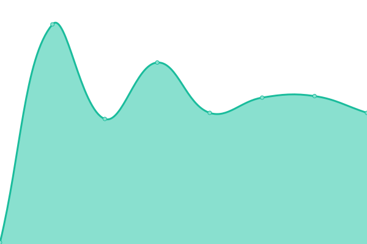

# [📈 Live Status](https://freehostingnodeuptime.tinkerhost.net): <!--live status--> **🟩 All systems operational**

This repository contains the open-source uptime monitor and status page for [TinkerHost](https://tinkerhost.net), powered by [Upptime](https://github.com/upptime/upptime).

With [Upptime](https://upptime.js.org), you can get your own unlimited and free uptime monitor and status page, powered entirely by a GitHub repository. We use [Issues](https://github.com/TinkerHost/upptime-free-hosting-central-servers/issues) as incident reports, [Actions](https://github.com/TinkerHost/upptime-free-hosting-central-servers/actions) as uptime monitors, and [Pages](https://freehostingnodeuptime.tinkerhost.net) for the status page.

<!--start: status pages-->
<!-- This summary is generated by Upptime (https://github.com/upptime/upptime) -->
<!-- Do not edit this manually, your changes will be overwritten -->
<!-- prettier-ignore -->
| URL | Status | History | Response Time | Uptime |
| --- | ------ | ------- | ------------- | ------ |
|  QFW1 | 🟩 Up | [qfw-1.yml](https://github.com/TinkerHost/upptime-free-hosting-central-servers/commits/HEAD/history/qfw-1.yml) | 

 130ms
     
 | 

<a href="https://freehostingnodeuptime.tinkerhost.net/history/qfw-1">100.00%</a>
    

|  QFW2 | 🟩 Up | [qfw-2.yml](https://github.com/TinkerHost/upptime-free-hosting-central-servers/commits/HEAD/history/qfw-2.yml) | 

 130ms
     
 | 

<a href="https://freehostingnodeuptime.tinkerhost.net/history/qfw-2">100.00%</a>
    

|  QFW3 | 🟩 Up | [qfw-3.yml](https://github.com/TinkerHost/upptime-free-hosting-central-servers/commits/HEAD/history/qfw-3.yml) | 

 129ms
     
 | 

<a href="https://freehostingnodeuptime.tinkerhost.net/history/qfw-3">100.00%</a>
    

|  QFW4 | 🟩 Up | [qfw-4.yml](https://github.com/TinkerHost/upptime-free-hosting-central-servers/commits/HEAD/history/qfw-4.yml) | 

 129ms
     
 | 

<a href="https://freehostingnodeuptime.tinkerhost.net/history/qfw-4">100.00%</a>
    

|  QF5 | 🟩 Up | [qf-5.yml](https://github.com/TinkerHost/upptime-free-hosting-central-servers/commits/HEAD/history/qf-5.yml) | 

 129ms
     
 | 

<a href="https://freehostingnodeuptime.tinkerhost.net/history/qf-5">100.00%</a>
    

|  QFW6 | 🟩 Up | [qfw-6.yml](https://github.com/TinkerHost/upptime-free-hosting-central-servers/commits/HEAD/history/qfw-6.yml) | 

 129ms
     
 | 

<a href="https://freehostingnodeuptime.tinkerhost.net/history/qfw-6">100.00%</a>
    

|  PM1 | 🟩 Up | [pm-1.yml](https://github.com/TinkerHost/upptime-free-hosting-central-servers/commits/HEAD/history/pm-1.yml) | 

 129ms
     
 | 

<a href="https://freehostingnodeuptime.tinkerhost.net/history/pm-1">100.00%</a>
    

|  PM2 | 🟩 Up | [pm-2.yml](https://github.com/TinkerHost/upptime-free-hosting-central-servers/commits/HEAD/history/pm-2.yml) | 

 159ms
     
 | 

<a href="https://freehostingnodeuptime.tinkerhost.net/history/pm-2">100.00%</a>
    

|  PM4 | 🟩 Up | [pm-4.yml](https://github.com/TinkerHost/upptime-free-hosting-central-servers/commits/HEAD/history/pm-4.yml) | 

 129ms
     
 | 

<a href="https://freehostingnodeuptime.tinkerhost.net/history/pm-4">100.00%</a>
    

|  FP5 | 🟩 Up | [fp-5.yml](https://github.com/TinkerHost/upptime-free-hosting-central-servers/commits/HEAD/history/fp-5.yml) | 

 129ms
     
 | 

<a href="https://freehostingnodeuptime.tinkerhost.net/history/fp-5">100.00%</a>
    

|  FP6 | 🟩 Up | [fp-6.yml](https://github.com/TinkerHost/upptime-free-hosting-central-servers/commits/HEAD/history/fp-6.yml) | 

 129ms
     
 | 

<a href="https://freehostingnodeuptime.tinkerhost.net/history/fp-6">100.00%</a>
    

|  FP7 | 🟩 Up | [fp-7.yml](https://github.com/TinkerHost/upptime-free-hosting-central-servers/commits/HEAD/history/fp-7.yml) | 

 130ms
     
 | 

<a href="https://freehostingnodeuptime.tinkerhost.net/history/fp-7">100.00%</a>
    

|  FP8 | 🟩 Up | [fp-8.yml](https://github.com/TinkerHost/upptime-free-hosting-central-servers/commits/HEAD/history/fp-8.yml) | 

 129ms
     
 | 

<a href="https://freehostingnodeuptime.tinkerhost.net/history/fp-8">100.00%</a>
    

|  FW33 | 🟩 Up | [fw-33.yml](https://github.com/TinkerHost/upptime-free-hosting-central-servers/commits/HEAD/history/fw-33.yml) | 

 129ms
     
 | 

<a href="https://freehostingnodeuptime.tinkerhost.net/history/fw-33">100.00%</a>
    

<!--end: status pages-->

[**Visit our status website →**](https://freehostingnodeuptime.tinkerhost.net)

## 📄 License

- Powered by: [Upptime](https://github.com/upptime/upptime)
- Code: [MIT](./LICENSE) © [Anand Chowdhary](https://anandchowdhary.com), supported by [Pabio](https://pabio.com)
- Data in the `./history` directory: [Open Database License](https://opendatacommons.org/licenses/odbl/1-0/)
